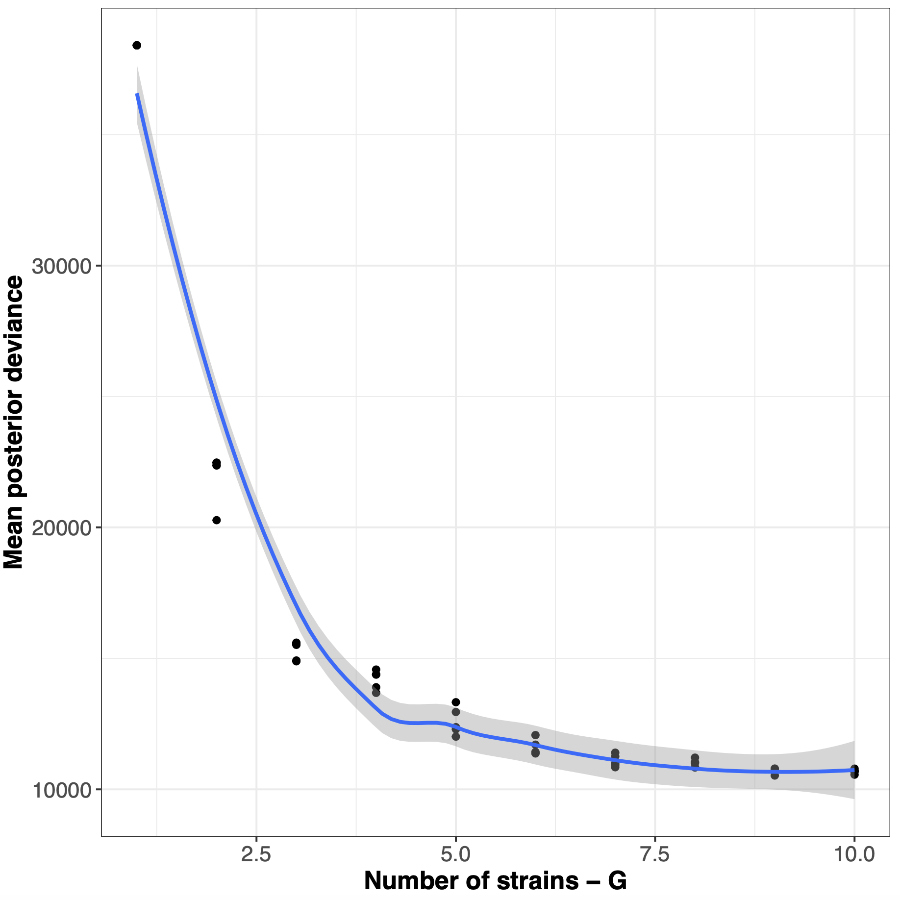

# Ebame6

# STRONG - Strain Resolution ON Graphs

## Overview

STRONG resolves strains on assembly graphs by resolving variants on core COGs using co-occurrence across multiple samples.

In this tutorial we will run the complete STRONG pipeline on a small AD time series. To 
begin we need to set-up our config file. This has been **mostly** prepared for you but will require a small amount of editing. 

## Getting started

Create a VM - EBAME-Quince preferably 8 cores xlarge and login with ssh using X-windows forwarding.

Then we activate the STRONG conda

```
conda activate STRONG
```

## Coassembly

Start off by moving into the /mnt directory create new directory Projects (if not already there) and subdirectory STRONG_AD:

```
cd ~/data/mydatalocal

mkdir Projects

cd Projects

mkdir STRONG_AD

cd STRONG_AD

```

Can you remember the flag to create a directory and move to it?

Then link in the short reads:

```


ln -s /home/ubuntu/data/public/teachdata/ebame/Quince-data-2021/Quince_datasets/AD_small data


```
Have a look at the data folder structure:

```
ls data
```

<details><summary>Can you count the number of reads in sample1?</summary>


<p>

```
echo $(cat data/sample1/sample1_R1.fastq |wc -l)/4| bc
```

</p>
</details>

Can you understand what each program does here, cat, wc, bc

Now copy in the STRONG config file:

```
cp ~/repos/Ebame21-Quince/configs/config.yaml .
```

Look at the config.yaml with more:
```
more config.yaml
```


Minimise that pesky prompt!
```
PS1='\u:\W\$ ' 
```

We will begin by performing the SPADEs coassembly. First good practice is to check what would be run if command issued:

```
STRONG --config config.yaml Results assembly --threads 8 --dryrun --verbose
```

Will run over 150 processes! STRONG is a complex pipeline.

 


Then run coassembly for real:

```
STRONG --config config.yaml Results assembly --threads 8 --verbose
```

This should take about twenty minutes. When it does done we can have a look at the coassembly outputs. The actual contigs are here:

```
./Results/assembly/spades/contigs.fasta
```

How good was the coassembly, what was the N50?

How does it compare to the megahit coassembly in Seb's tutorial?


```
~/repos/Ebame21-Quince/scripts/contig-stats.pl < ./Results/assembly/spades/contigs.fasta
```

sequence #: 1966	total length: 6377796	max length: 174676	N50: 28942	N90: 3000

Other useful things to look at include the simplified graph that will be used for strain resolution. If you have enough memory on your local computer this can be visuaised with Ryan Wick's excellent [Bandage](https://github.com/rrwick/Bandage) program:


```
ls -l -h assembly/high_res/simplified.gfa
```

 

And the unitig per sample profiles, these are generated by thread threading reads onto the simplified graph, Sergey Nurk's application ***unitig-coverage*** does this:

```
tail assembly/high_res/simplified.mult_prof
```

This step of the pipeline also does bowtie2 mapping of reads onto contigs to get coverage 
profiles for binning:

```
head profile/split/coverage.tsv 
```

It also does the actual binning using as default a two step version of CONCOCT although metabat2 is an option:

```
more binning/concoct/list_mags.tsv
```

There should be three MAGs generated for the next steps in the analysis. Can look at 
SCG frequencies in MAGs:

```
cd binning/concoct/

tr "," "\t" < SCG_table_concoct.csv > SCG_table_concoct.tsv

cp ~/repos/Ebame21-Quince/scripts/COGPlot.R .

./COGPlot.R -s SCG_table_concoct.tsv -o SCG_table_concoct.pdf

```

 


## Subgraph Extraction

The next step is to extract out and simplify the SCG subgraphs for the actual bayespaths strain finding. We run this as above just change assembly to graphextraction:

```

cd ~/data/mydatalocal/Projects/STRONG_AD

STRONG --config config.yaml Results graphextraction --threads 8 --verbose
```

Can look at the results which are again in gfa format:

```
cd Results/subgraphs/bin_merged
```

Which are again in gfa format with coverages, the raw subgraph unitigs match to the original simplified gfa but the simplified do not:

 

## BayesPaths

These steps generate all the input required for the strain resolving algorithm BayesPaths. This can be run automatically within STRONG but we do a few trial runs to better 
understand the inputs first. Let's test out the most complex bin Bin_2 in my run:

```
wc Bin_*/simplif/*0060*tsv
```

COG0060 for this MAG looks like:

 

We might estimate this contains three strains, can we confirm that. We will do a trial run of BayesPaths to test this, in a new directory:

```
cd ~/data/mydatalocal/Projects/STRONG_AD/Results
mkdir BPTest
cd BPTest
```


Then we will run BayesPaths with a minimum number of NMF iterations and the gene filtering disabled. Type ***bayespaths*** for usage. 

```
usage: bayespaths [-h] [-l [COG_LIST]] [-t [LENGTH_LIST]] [-f [FRAC_COV]]
                  [-m [MIN_COV]] [-mf [MIN_FRAC_COV]] [-g [STRAIN_NUMBER]]
                  [--loess] [--no_gam] [--no_ard] [--no_noise] [-i ITERS]
                  [-nfo NOFOLDS] [-r [READLENGTH]] [-s RANDOM_SEED]
                  [-e [EXECUTABLE_PATH]] [-u [UNCERTAIN_FACTOR]]
                  [-nr NMF_ITERS] [-ngf MAX_GITER] [--noscale_nmf]
                  [--nofilter] [--norun_elbow] [--norelax] [--nobias]
                  [--bias_type {unitig,gene,bubble}]
                  [--tau_type {fixed,log,empirical,auto,poisson}]
                  [--nogenedev]
                  Gene_dir kmer_length outFileStub
bayespaths: error: the following arguments are required: Gene_dir, kmer_length, outFileStub
```

Then run:
```
ln -s ../subgraphs/bin_merged/Bin_2/simplif Bin_2

cp ~/repos/STRONG/BayesPaths/Data/coreCogs.tsv .

```

and finally bayespaths itself:

```

bayespaths Bin_2/simplif 77 Bin_2_small -r 150 -l Bin_2/selected_cogs.tsv -t coreCogs.tsv -g 8 --nofilter -nr 1 -e ~/repos/STRONG/BayesPaths/runfg_source/```

```

This will take a little time. It should select three strains. We can have a look at the 
output:

Generate a simple plot of fit:

```
R
>Pred <- read.csv('Bin_2_smallF_Pred.csv',header=T)
>library(ggplot2)
>png('X.png')
>qplot(data=Pred,x=X_est,y=X) + geom_smooth() + theme_bw()
>dev.off()
>q()
```

Then visualise plot:
```
evince X.png
```

 

```
grep "COG0060" Bin_2_smallF_maxPath.tsv | sed 's/COG0060_//g' > Bin_2_smallF_maxPath_COG0060.tsv
python ~/repos/STRONG/BayesPaths/scripts/Add_color.py Bin_2/simplif/COG0060.gfa Bin_2_smallF_maxPath_COG0060.tsv > COG0060_color.gfa
```

This can be visualised in Bandage on your local machine may be easier


We can also look at the time series of strain abundances: 

```
cp ~/repos/Ebame21-Quince/scripts/GammaPlot.R .
R
>source('GammaPlot.R)
>q()
```


Now run BayesPaths on all three bins will take 20-30mins
```
cd /home/ubuntu/data/mydatalocal/Projects/STRONG_AD
STRONG --config config.yaml Results bayespaths --threads 8 --verbose
```

We can generate results dir now:
 
```
STRONG --config config.yaml Results results --threads 8 --verbose
```    

```
cd Results/results/Bin_2
```

Joined graph is useful indicates that we have probably missed a strain on this example, this might be down to not running gene filtering or multiple NMF iterations.


The haplotypes_tree.pdf has a phylogeny of strains and a heatmap giving percent divergences.


and even run DESMAN

```
STRONG --config config.yaml Results desman --threads 8 --verbose
```    


