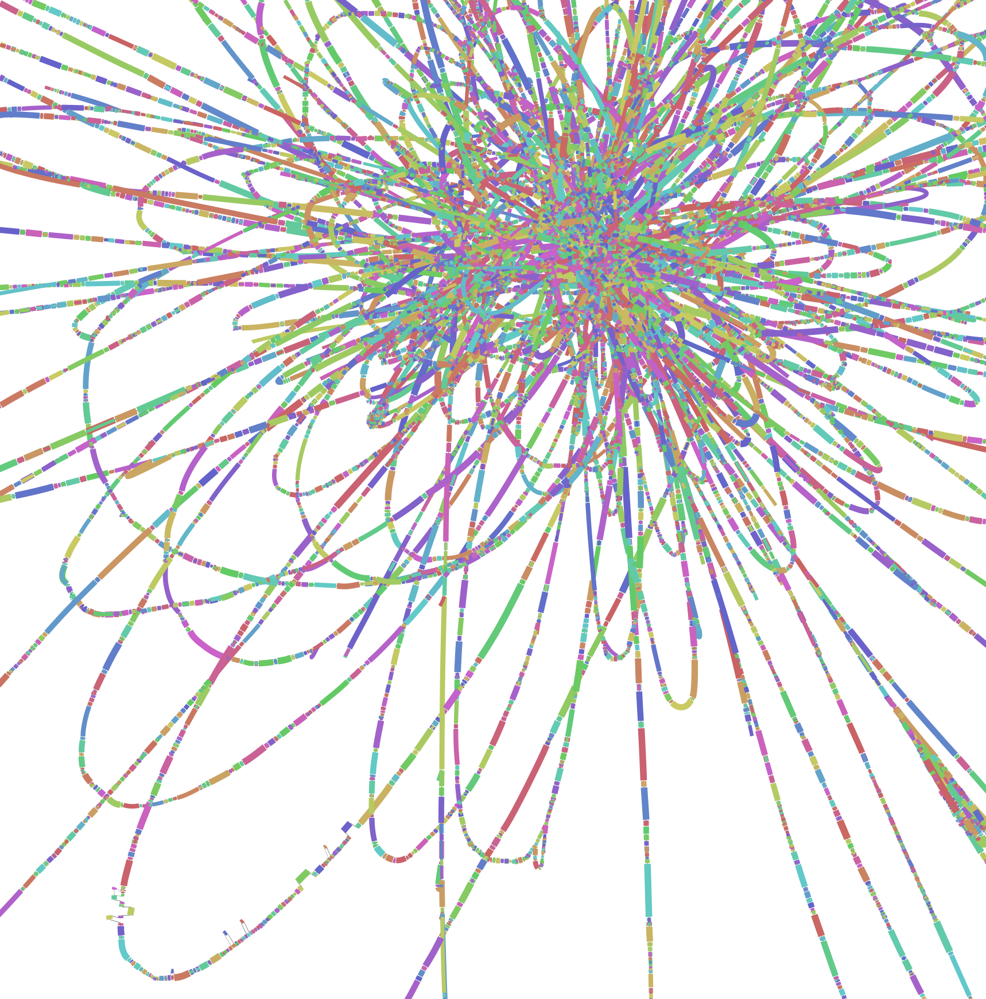
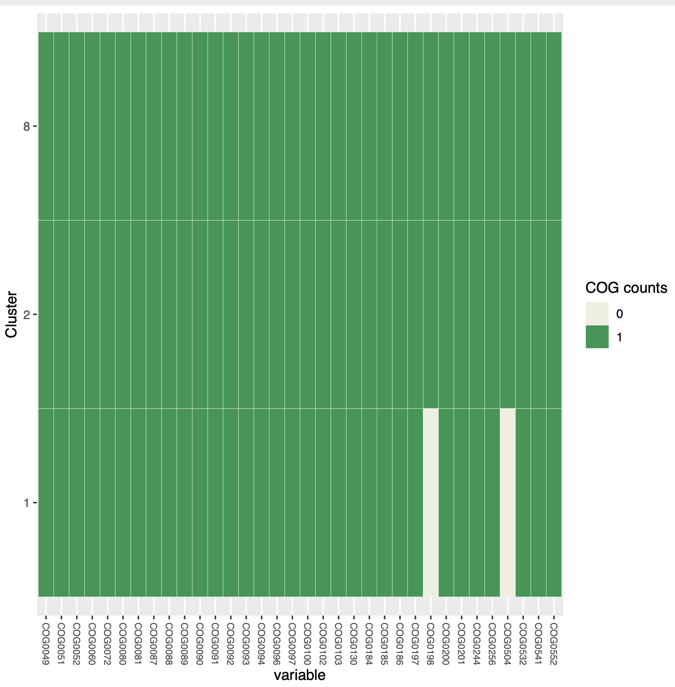
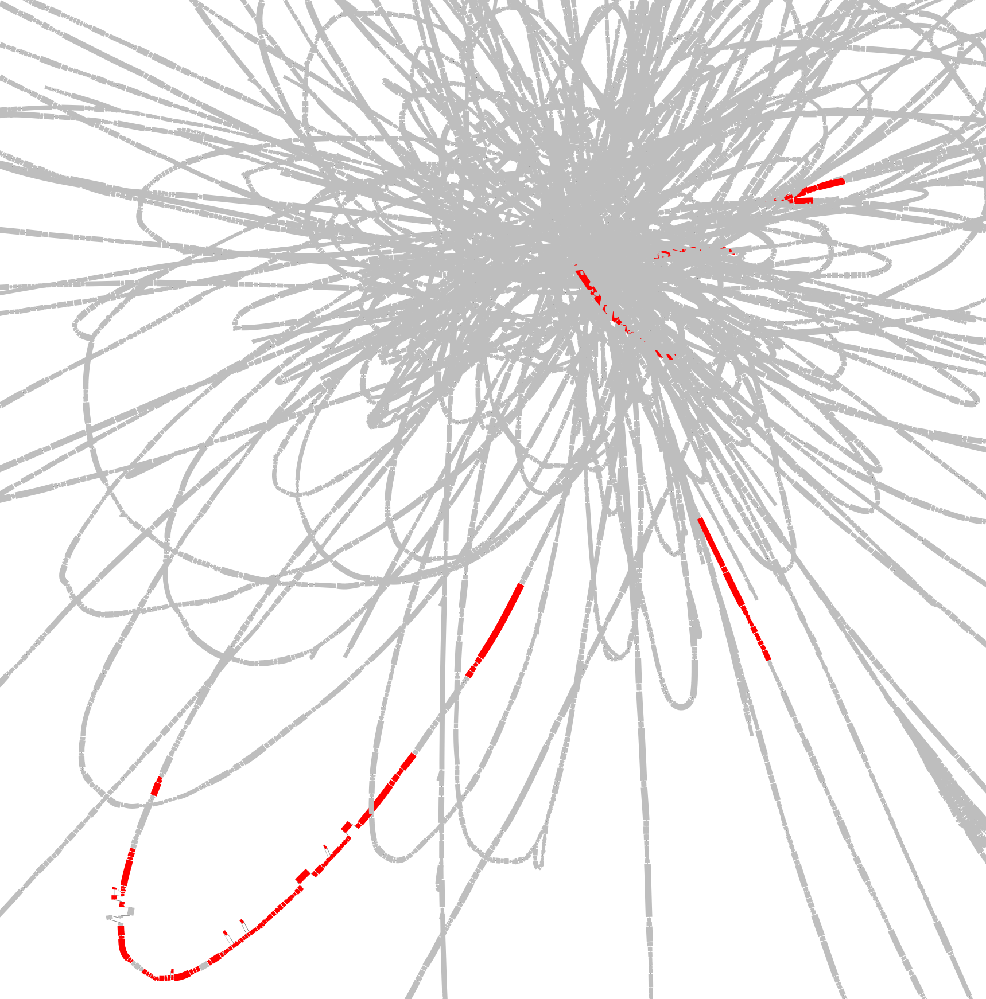
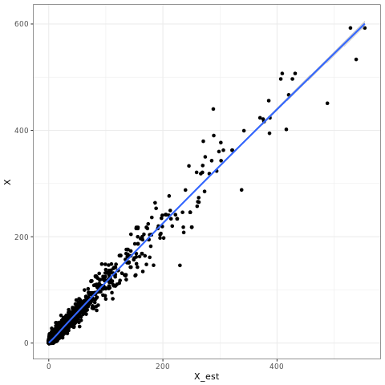
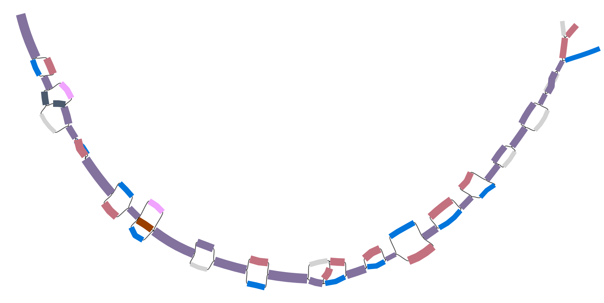
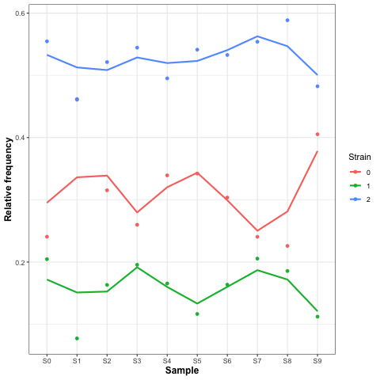
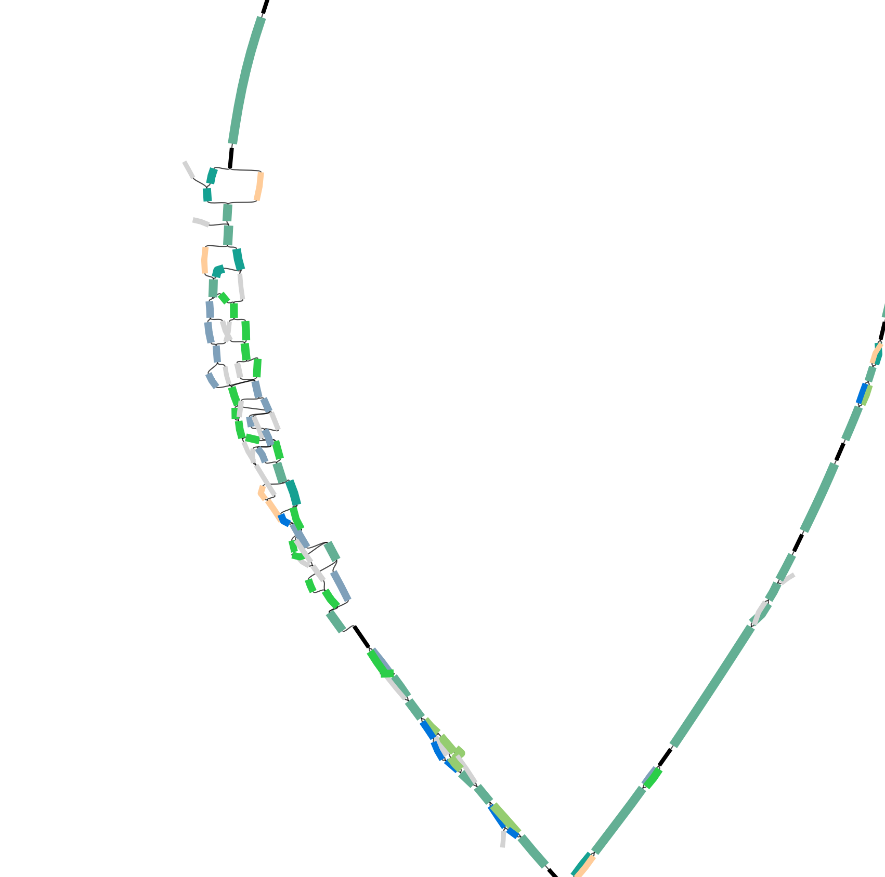
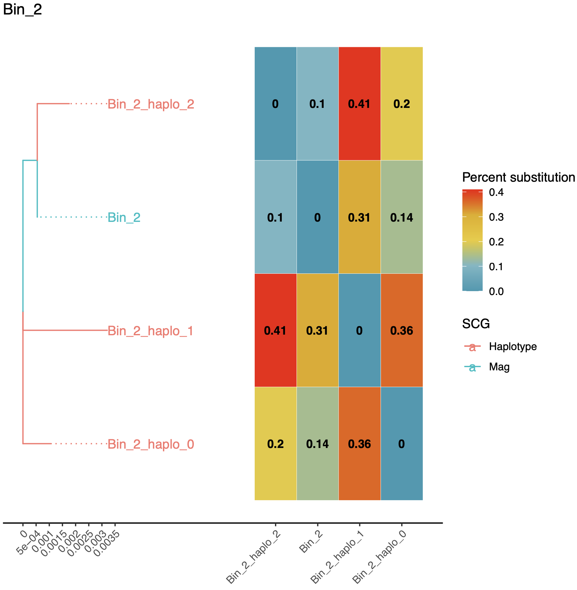
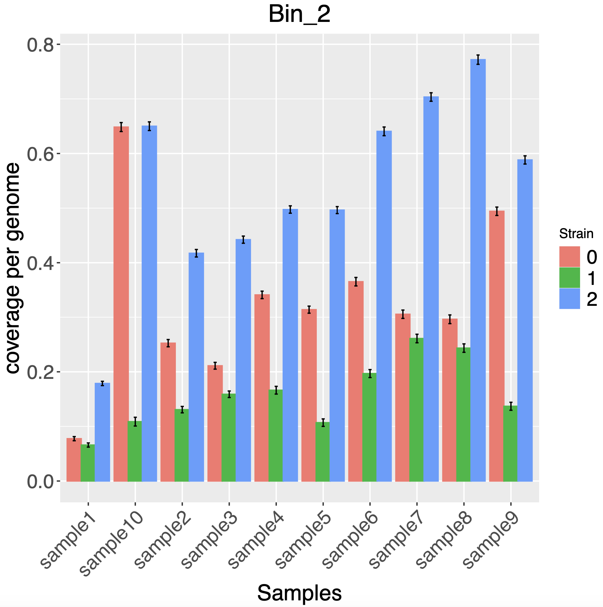

# Practical : Strain resolution

Plan for the session:
- learn how to launch the STRONG pipeline
- learn the main step of the analysis, and it's expected output

##  STRONG - Strain Resolution ON Graphs


### Overview


The STRONG pipeline can be subdivided in these 4 main steps.
Steps
1. ***assembly***: coassembly of sample, binning, MAG assessment
2. ***graphextraction***: extract cogs subgraphs
3. ***bayespaths***: Use bayespaths to infer strains and coverage
4. ***results***:  Generate results figures. 

STRONG resolves strains on assembly graphs by resolving variants on core COGs using co-occurrence across multiple samples.

###  Before starting
#### Installation
STRONG is already installed on your VM, you will find the git repos at: 
`~/repos/STRONG`
It is a clone of the one available online and installation steps are detailed [there](https://github.com/chrisquince/STRONG).

**Packages needed**:
Current installation depend entirely on [conda](https://docs.conda.io/en/latest/), by creating an environment where all packages and their dependencies are installed. 

Look at : `~/repos/STRONG/conda_env.yaml`

fasttree is a dependency, it has been installed, try :

    fasttree -h
<details><summary>not working?</summary>
<p>
Try activating the relevant conda environment :

    conda env list
    conda activate STRONG
    fasttree -h

</p>
</details>


**Databases**

 - [COG database](ftp://ftp.ncbi.nlm.nih.gov/pub/mmdb/cdd/little_endian) , you will find it installed at
    `/home/ubuntu/data/public/teachdata/ebame-2022/metagenomics/COG`

 - (optional) [GTDB](https://pubmed.ncbi.nlm.nih.gov/30148503/) , used
   with gtdb-tk, (77Gb) too much ram needed and execution too slow for this present tutorial.

#### Dataset
Anaerobic digester metagenomic time series subsampled for this tutorial, reads mapping only to a few bins of interest.

Start off by moving into the ~/data/mydatalocal directory create new directory Projects (if not already there) and subdirectory STRONG_AD:

```
cd ~/data/mydatalocal

mkdir STRONG_AD

cd STRONG_AD

```

Can you remember the flag to create a directory and move to it?

Then link in the short reads:

```

ln -s /home/ubuntu/data/public/teachdata/ebame-2022/metagenomics/Quince_datasets/AD_small data

```

 Look inside a read file with nano, less, head, tail, more or any such:

<details><summary>How to count the number of reads?</summary>
<p>

 ```bash
echo $(cat data/sample1/sample1_R1.fastq | wc -l )/4| bc
  ```

Can you understand what each program does here, cat, wc, bc?

while not exhaustive, have a look at cheatsheets for bash [commands](https://cheatography.com/davechild/cheat-sheets/linux-command-line/) , or bash [scripting](https://devhints.io/bash). 
</p>
</details>

#### Additional files

Some part of STRONG are a bit too slow and we will have to work with pre-run results. Please download and extract theses files:
```bash

cd ~/data/mydatalocal/STRONG_AD

wget https://ebitutorial.s3.climb.ac.uk/Results.tar.gz

tar -xvzf Results.tar.gz

mv Results STRONG_prerun

```

### Launching STRONG :  config file
To use STRONG, you need to create a config file which is  used to store the parameters of a run. It is divided into  sections with parts corresponding to the different steps of the pipeline.

First minimise that pesky prompt!
```
PS1='\u:\W\$ ' 
```

Let's copy the config file template:

```bash
cd ~/data/mydatalocal/STRONG_AD
cp ~/repos/Ebame/config_template.yaml config.yaml
```
Look at the config.yaml with more:
```
more config.yaml
```
For 5-10 mins try to use the STRONG [documentation](https://github.com/chrisquince/STRONG) to fill in this config file. Edit the config file with nano or vi so that it runs the samples in:
```
 /home/ubuntu/data/mydatalocal/STRONG_AD/data
```

Check that your config file works with the dryrun command.
```bash
cd  ~/data/mydatalocal/STRONG_AD
rm -r STRONG_OUT
STRONG --config config.yaml STRONG_OUT assembly --threads 8 --dryrun --verbose
```
<details><summary>Is something wrong with your config file?</summary>
<p>

Debuging a config file:
 - First it has to be a valid .yaml file, [here](https://en.wikipedia.org/wiki/YAML) is the format definition and [here](http://www.yamllint.com/) is a validator. In short, don't forget indentations or colons. 
 - you only have 2 paths to fill the path to the sample **folder** and the path to the cog database. If you have issues, you may have mispellled any of these. Use the  `ls`   command to check the path exists.
 - the cog database path is `/home/ubuntu/data/public/teachdata/ebame-2022/metagenomics/COG/`
 - the data folder path is:  `/home/ubuntu/data/mydatalocal/STRONG_AD/data`
 <details><summary>It's still not working? </summary>
<p>

Well, we can't spend too long on debugging everybody, just copy and paste the correct config file from the strain_practical repo.

```bash
cd  ~/data/mydatalocal/STRONG_AD
cp  ~/repos/Ebame/config_correct.yaml config.yaml
```

</p>
</details>
</p>
</details>

When using the dryrun option what happens? 

### Assembly
Let's launch STRONG for real this time:
```bash
cd ~/data/mydatalocal/STRONG_AD
rm -r STRONG_OUT
STRONG --config config.yaml STRONG_OUT assembly --threads 8
```
We only started running the first step of STRONG, the assembly step, it consists of more than 150 tasks 
 

This should take about thirty minutes. We are not waiting for that instead kill the strong run using ***Ctrl-C*** and copy in the prerun assembly after cleaning up the output directory:

```
    cd  ~/data/mydatalocal/STRONG_AD
    rm -r -f STRONG_OUT
    mkdir STRONG_OUT
    cp -r ~/data/mydatalocal/STRONG_prerun/assembly ~/Projects/STRONG_AD/STRONG_OUT
```

The restart the assembly step:
```
    STRONG --config config.yaml STRONG_OUT assembly --threads 8
```

Whilst that is running login on a separate terminal so we can look at the assembly output - don't forget to restart the STRONG conda environment:


#### Coassembly

```bash
cd ~/data/mydatalocal/STRONG_AD
ls -lh assembly/spades/contigs.fasta
```

How good is the coassembly, what is the N50? What is a good coassembly? Btw, why a coassembly? when a coassembly?

```bash
~/repos/Ebame/scripts/contig-stats.pl < ./assembly/spades/contigs.fasta
```

sequence #: 1966    total length: 6377796   max length: 174676  N50: 28942  N90: 3000

#### Assembly graph
Other useful things to look at include the simplified graph that will be used for strain resolution. This can be visualised with Ryan Wick's excellent [Bandage](https://github.com/rrwick/Bandage) program:


```bash
ls -l -h assembly/high_res/simplified.gfa
```

 

Why do we use a "high resolution assembly graph"?

Lets take some time to look at the assembly graph with bandage
```bash
 Bandage load assembly/high_res/simplified.gfa`
```

Bandage can be run on the VMs and viewed through X-windows if that is installed on your local computer but you need to login with ***ssh -Y*** 

If the connection is bad an alternative is to install Bandage on your laptop and download the gfa files e.g.:

```
scp ubuntu@my.ip.add:~/data/mydatalocal/STRONG_AD/STRONG_prerun/assembly/high_res/simplified.gfa .
``` 


 
Using Bandage it is possible to extract part of the assembly graph with a command such as 


```bash
 Bandage reduce <INPUT_GRAPH.gfa>  <NAME_OF_OUTPUT.gfa> --scope aroundnodes --nodes <NODE> --distance 0
```
I did that for the exact same COG0016 from 3 assembly graph files: 
- on `assembly/spades/assembly_graph_with_scaffolds.gfa`
- on `assembly/high_res/graph_pack.gfa`
- on  `assembly/high_res/simplified.gfa`


Open and visualise the "simplified" assembly graph:

What are the differences between the 3 assemblies graph? Can you tell which sequence comes from which type of assembly?

On the normal assembly we can see a unique contig, but in reality there are 3 strains. Why is there only 1 contigs?


#### unitig multi sample coverage profile
And the unitig per sample profiles, these are generated by thread threading reads onto the simplified graph, Sergey Nurk's application ***unitig-coverage*** does this:

```bash
tail assembly/high_res/simplified.mult_prof
```


***Hopefully the assembly step should have finished by now so we can look at the binning output***


#### binning
This step of the pipeline also does bowtie2 mapping of reads onto contigs to get coverage 
profiles for binning:

```bash
cd ~/data/mydatalocal/STRONG_AD/STRONG_OUT
head profile/split/coverage.tsv 
```

It also does the actual binning using by default a two step version of CONCOCT although metabat2 is an option:

```bash
more binning/concoct/list_mags.tsv
```

There should be three MAGs generated for the next steps in the analysis. Can look at 
SCG frequencies in MAGs:

```bash
cd binning/concoct/
tr "," "\t" < SCG_table_concoct.csv > SCG_table_concoct.tsv
cp ~/repos/strain_resolution_practical/scripts/COGPlot.R .
Rscript ./COGPlot.R -s SCG_table_concoct.tsv -o SCG_table_concoct.pdf

```

Can visualise with evince if you have X-windows forwarding and logged on with ssh -Y:
```
evince SCG_table_concoct.pdf
```

 


## Subgraph Extraction

The next step is to extract out and simplify the SCG subgraphs for the actual bayespaths strain finding. We run this as above just change assembly to graphextraction:

```bash
cd ~/data/mydatalocal/STRONG_AD/
STRONG --config config.yaml STRONG_OUT graphextraction --threads 8 --verbose
```

Which are again in gfa format with coverages.
    

 - Raw subgraph: subgraph directly taken from `assembly/high_res/simplified.gfa`
 - simplified subgraph: Raw subgraph further processed "simplified" using coverage. These subgraph do not match the initial assembly graph.

 

## BayesPaths

These steps generate all the input required for the strain resolving algorithm BayesPaths. As it takes about 20~30 min to run automatically, let's launch it now. 

```bash
cd ~/data/mydatalocal/STRONG_AD/
STRONG --config config.yaml STRONG_OUT bayespaths --threads 8 --verbose
```

#### Manual version

Whilst we wait for that login on a separate terminal (don't forget to reactivate STRONG) and do a few trial runs to better understand the inputs first. Let's test out the most complex bin Bin_2 in my run:

```bash
cd ~/data/mydatalocal/STRONG_AD/STRONG_OUT/subgraphs/bin_merged
wc Bin_*/simplif/*0060*tsv
```

COG0060 for this MAG looks like:

 


Can look at the results which are again in gfa format:


Then visualise the simplified COG gfa in bandage:

```
Bandage load Bin_2/simplif/COG0060.gfa
```

Can you find and load the raw graph next - is there any difference?


We might estimate this contains three strains, can we confirm that. We will do a trial run of BayesPaths to test this, in a new directory:

```bash
cd ~/data/mydatalocal/STRONG_AD/STRONG_OUT
mkdir BPTest
cd BPTest
```


Then we will run BayesPaths with a minimum number of NMF iterations and the gene filtering disabled. Type ***bayespaths*** for usage. 

```
usage: bayespaths [-h] [-l [COG_LIST]] [-t [LENGTH_LIST]] [-f [FRAC_COV]]
                  [-m [MIN_COV]] [-mf [MIN_FRAC_COV]] [-g [STRAIN_NUMBER]]
                  [--loess] [--no_gam] [--no_ard] [--no_noise] [-i ITERS]
                  [-nfo NOFOLDS] [-r [READLENGTH]] [-s RANDOM_SEED]
                  [-e [EXECUTABLE_PATH]] [-u [UNCERTAIN_FACTOR]]
                  [-nr NMF_ITERS] [-ngf MAX_GITER] [--noscale_nmf]
                  [--nofilter] [--norun_elbow] [--norelax] [--nobias]
                  [--bias_type {unitig,gene,bubble}]
                  [--tau_type {fixed,log,empirical,auto,poisson}]
                  [--nogenedev]
                  Gene_dir kmer_length outFileStub
bayespaths: error: the following arguments are required: Gene_dir, kmer_length, outFileStub
```

Then run:
```bash
ln -s ../subgraphs/bin_merged/Bin_2 Bin_2
cp ~/repos/STRONG/BayesPaths/Data/coreCogs.tsv .
```

and finally bayespaths itself:

```bash
bayespaths Bin_2/simplif 77 Bin_2 -r 150 -l Bin_2/selected_cogs.tsv -t coreCogs.tsv -g 4 --nofilter -nr 1 -e ~/repos/STRONG/BayesPaths/runfg_source/
```

This will take a little time. It should select three strains. We can have a look at the output:

If it takes too long on your VM have a look at the prerun results:
```bash
cd ~/data/mydatalocal/STRONG_AD/STRONG_prerun/bayespaths/Bin_2
```
Otherwise stay in this dir.

Then let's look at the output files:
#### Bin_2F_Pred.csv
Bin_2F_Pred.csv contains coverage of unitigs as well as coverage from strain contributions. 

Let's generate a simple plot of fit:

```
R
Pred <- read.csv('Bin_2F_Pred.csv',header=T)
library(ggplot2)
pdf('X.pdf')
qplot(data=Pred,x=X_est,y=X) + geom_smooth() + theme_bw()
dev.off()
q()
```

Then visualise plot:
```
evince X.pdf
```

 

#### Bin_2F_maxPath.tsv
```
grep "COG0060" Bin_2F_maxPath.tsv | sed 's/COG0060_//g' > Bin_2F_maxPath_COG0060.tsv
python ~/repos/STRONG/BayesPaths/scripts/Add_color.py ../../subgraphs/bin_merged/Bin_2/simplif/COG0060.gfa Bin_2F_maxPath_COG0060.tsv > COG0060_color.gfa
```

This can be visualised in Bandage on your local machine may be easier
```
Bandage load COG0060_color.gfa
```




We can also look at the time series of strain abundances: 

```
cp ~/repos/strain_resolution_practical/scripts/GammaPlot.R .
R
source('GammaPlot.R')
q()
```




### Generate results


If the STRONG bayespaths step has finished we can generate results dir now:
 
```bash
cd ~/data/mydatalocal/STRONG_AD/
STRONG --config config.yaml STRONG_OUT results --threads 8 --verbose

```    

The summary files gives information on number of mags, strains and taxonomy. Other files shows concatenation of Bin specific results.


#### Bin specific results
```
cd ~/data/mydatalocal/STRONG_AD/STRONG_OUT/results/Bin_2
```

Joined graph is useful indicates that we have probably missed a strain on this example, this might be down to not running gene filtering or multiple NMF iterations.



The haplotypes_tree.pdf has a phylogeny of strains and a heatmap giving percent divergences.







### MAG taxonomy

STRONG will run gtdb on MAGs as standard but this is too slow and uses too much RAM. For now just have a look at the pre-run results: 

```bash
cd ~/data/mydatalocal/STRONG_AD/STRONG_OUT
ln -s ~/data/mydatalocal/STRONG_AD/STRONG_OUT/STRONG_prerun/results result_prerun
```

Have a look at the summary file to find out the identity of the MAGs.

```
more summary.tsv
```

To run gtdb you need to add a line inside the config file with the path to gtdb database.

## Extra things

Can you run the desman step?

Can you run STRONG with metabat2?

Can you taxonomically assign contigs with Kraken?


